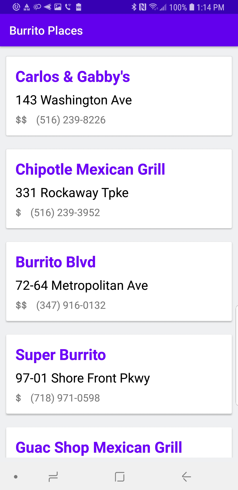
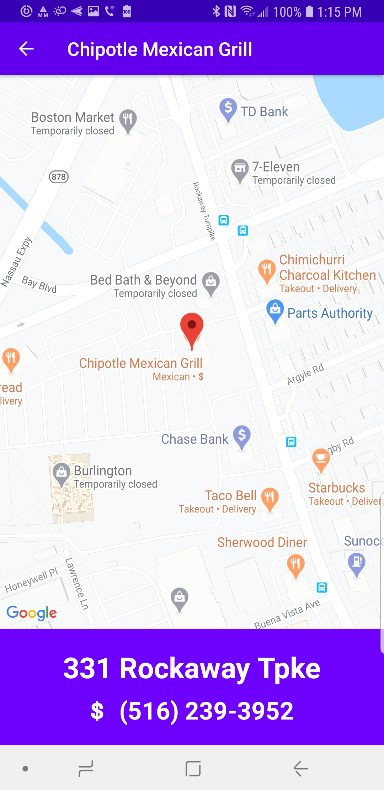

# Burrito Buddy

Burrito Buddy (trademark pending) searches Yelp for restaurants that serve burritos within a 12 mile radius of you. After grabbing your location, Burrito Buddy will list all nearby burrito joints. Simply click on one to see it on Google Maps with more details. 

## Getting Started

1. Clone Repository from Github
2. Be sure to run on a phone so it can get your real location. If you must use an emulator be sure to enable the location feature.
3. Run the app and accept location permission prompt.
4. Find and enjoy some burritos.

## App Architecture

This app utilizes an MVVM design pattern with a single activity and multiple fragment approach. The activity and fragments share a view model (NavigationViewModel) and use LiveData to communicate with one another and handle navigation. 

## Notable Features

* API Keys and secrets have been ofsucated for security
* Data Binding was used in RestaurantMapFragment for easy view updates
* Apollo and OKHTTP are singletons to prevent unnecessary instances 

## Third Party Tools Used

* [Apollo Android](https://github.com/apollographql/apollo-android) - A strongly-typed, caching GraphQL client for Android
* [OkHttp](https://github.com/square/okhttp/) - Square’s HTTP client for Java and Kotlin
* [Google Maps](https://developers.google.com/android/reference/com/google/android/gms/maps/package-summary) - Google Maps SDK for Android
* [Google Location](https://developers.google.com/android/reference/com/google/android/gms/location/package-summary) - Google Location SDK for Android
* [Eazy Permissions](https://github.com/sagar-viradiya/eazypermissions) - Android DSL library to handle runtime permissions

## What's Next?

1. Add in Apollo caching for fetched data
2. Add in OkHttp logging interceptor
3. Add in search bar to search for other types of food
4. Allow user to search in different areas
5. Add in loader while data is being fetched
6. Create shared, styled alert dialog
7. Add in tests

## Authors

**Dan Hefter**

## License

This project is licensed under the MIT License - see the [LICENSE.md](LICENSE.md) file for details

